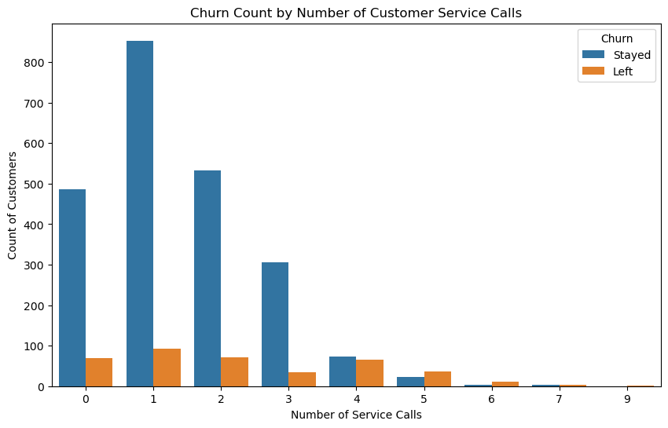
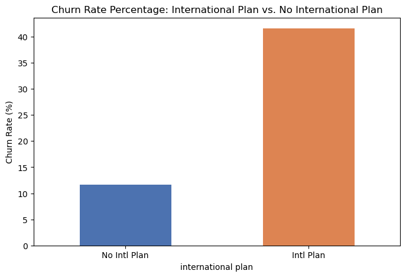
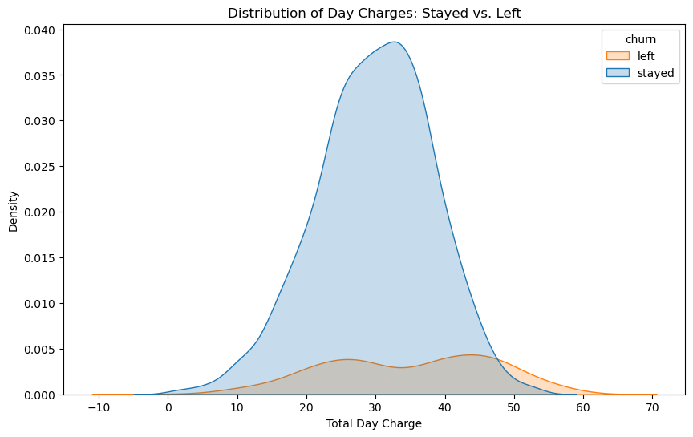
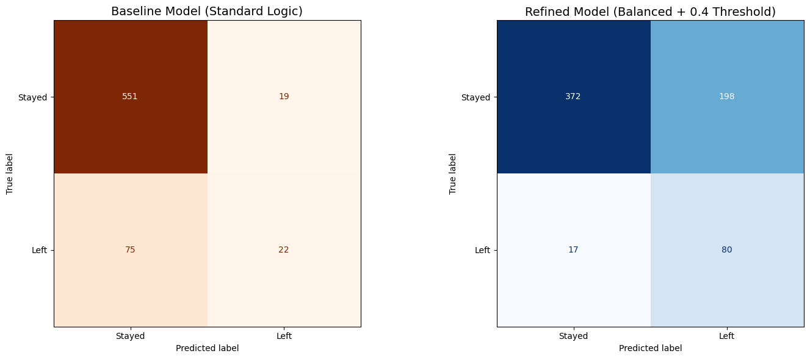
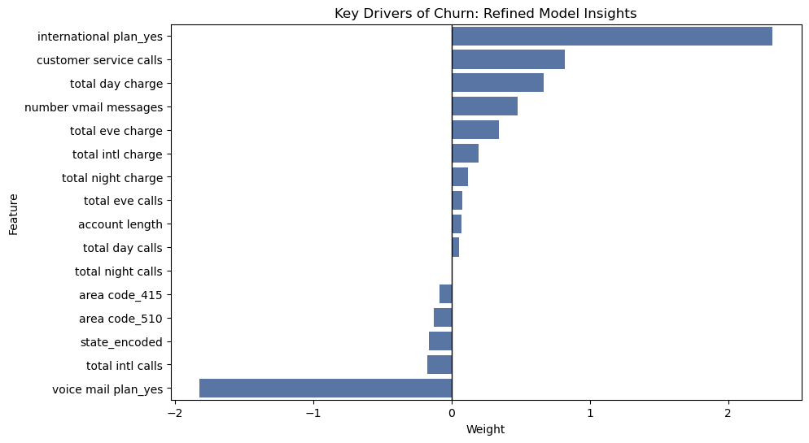

# **Customer Churn Prediction: Strategic Retention for SyriaTel Company**
Leveraging raw telecom data to identify churn drivers and predict customer churn using Logistic Regression. A data-driven approach to understanding and improving customer lifecycle management.

# **Overview**

This project aims at developing a predictive machine learning model that identifies 'potential churners' customers for Syria Tel Company. Instead of waiting for customers to leave, the business can use this tool to take action early, directly impacting long-term revenue and market share.

# **Business and Data**
## Business Problem
SyriaTel telecom company would like to identify potential 'churners' (Customers before they leave) and take the necessary steps to retain them.

## Stakeholder Audience
**Primary:**  Executive Leadership and Marketing (Retention) Team.

**Objective:** Minimize customer attrition (churn) by identifying high-risk behavior patterns.

**Business Logic:** The cost of retention (e.g., a targeted discount) is significantly lower than the Customer Acquisition Cost. We prioritize Recall to ensure we don't miss potential leavers.

## Data
- The dataset used in this project can be accessed [here.](https://www.kaggle.com/datasets/becksddf/churn-in-telecoms-dataset)

  
The model is trained on customer activity data, including:

- **Demographics:** Account length and geographic location (State/Area Code).

- **Service Plans:** International and Voice Mail plan subscriptions.

- **Usage Metrics:** Daily, evening, and night charges/minutes.

- **Pain Points:** Frequency of customer service interactions.

 **Note:** "Minutes" columns were removed during preprocessing to address perfect multicollinearity with "Charge" columns, ensuring a more stable and interpretable model.
 ## Distribution of the Target Variable
 | Class | Count | Percentage |
| :--- | :--- | :--- |
| Stayed (0) | 2,850 | ~85.5% |
| Churn (Left (1)) | 483 | ~14.5% |
- Majority of the customers stayed while only a small percentage left.
- For this reason, Recall and AUC-ROC are preffered metrics of model evaluation over Accuracy.

# **Exploratory Data Analysis (EDA)**
I discovered Customer Service Calls, International Plan, and Total Day Charge to be important features in modeling. 

## Exploring Customer Service Calls and Count of Customers

- Customers are at high risk of leaving after 3 service calls.

## Exploring International Plan and Churn Rate

- Customers with international plans have significantly higher churn rate as compared to the ones without.

## Exploring Total Day Charge and Churn

- If a customer's daily charge exceeds $48, there is an overwhelming probability that they will leave.

#### *For more in-depth visualizations, explore: ['churn_eda'](https://github.com/clivekinyanjui/Telecom-Customer-Retention/blob/main/Notebooks/churn_eda.ipynb) notebook.*
# **Modeling**

I implemented a Logistic Regression model, chosen for its high interpretability and efficiency. To address the inherent class imbalance (more customers stay than leave), I refined the baseline through:

- **Cost-Sensitive Learning:** Setting class_weight='balanced' to penalize missing the minority "Churn" class.

- **Threshold Optimization:** Adjusted the classification threshold to 0.4 to further prioritize the identification of at-risk customers.

# **Evaluation**
The model was evaluated based on its ability to support a proactive business strategy.
## Metrics Justification

|  **Metric** |  **Baseline Model** |  **Refined Model** | **Business Impact** |
| :--- | :--- | :--- | :--- |
| **Recall** | 0.2268 | **0.82447** | We catch 4x more potential churners. |
| **Precision** | 0.5366 | 0.2878 | Acceptable trade-off for higher safety |
| **AUC Score**| 0.8171 | 0.8161 | Stable predictive power. |
| **False Negatives** | 75 | **17** | 58 additional customers 'saved.' |

## Visual Justification:

- The refined model (Blue) successfully captures the vast majority of churners (80) compared to the conservative baseline (Orange - 22), aligning with our "Business-First" goal of high sensitivity.

#### *Explore ['churn_model'](https://github.com/clivekinyanjui/Telecom-Customer-Retention/blob/main/Notebooks/churn_model.ipynb) for a comprehensive view of the modeling process.*
# **Insights**
## Key Drivers of Churn:

- **International Plan:** Users with this plan are the most likely to leave, suggesting a need for more competitive pricing or transparent terms.

- **Customer Service Calls:** A clear "Frustration Metric"; calls exceeding 3 per month are a major red flag.

- **Total Day Charge:** High daily spend acts as a financial trigger for churn.

- **Voicemail Plan** Users with this plan stay loyal. New customers should be incentivised to set up voicemail.

# **Conclusion**
- *The Refined Model prioritizes recall(82%) and is able to identify high-risk customers with an international plan and frequent customer service callers early. This allows the stakeholders to move from losing 75 customers silently to securing 80 high-risk customers through targeted interventions.*

# **Final Recommendation:**
Implement a High-Touch Retention Protocol for any customer flagged by the model, specifically targeting those with International Plans who have called Customer Service more than twice.

*You may view a presentation of the model here: [presentation slides](https://github.com/clivekinyanjui/Telecom-Customer-Retention/blob/main/Presentations/churn_presentation.pdf), [video](https://drive.google.com/file/d/17ZZyNfQDPaOG8SEMdihuNsVLDDdbcaZO/view?usp=sharing).*

[My Email](clivekinyanjui@gmail.com).

[My LinkedIn Profile](www.linkedin.com/in/clive-kinyanjui).
